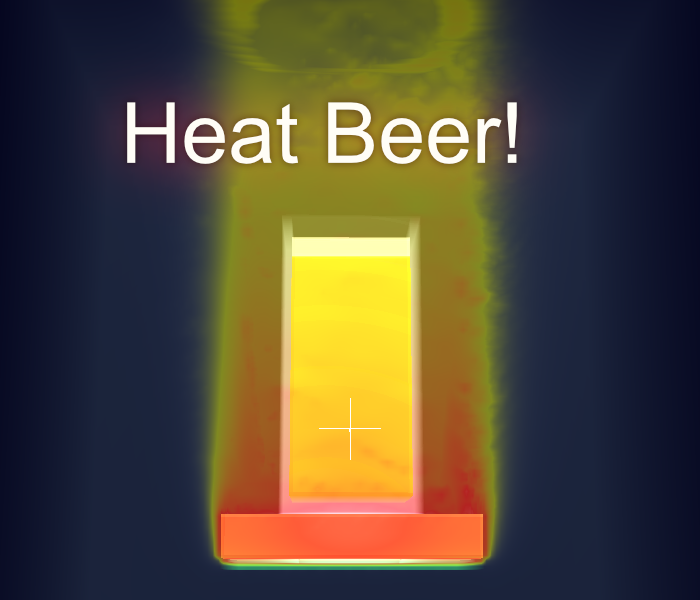
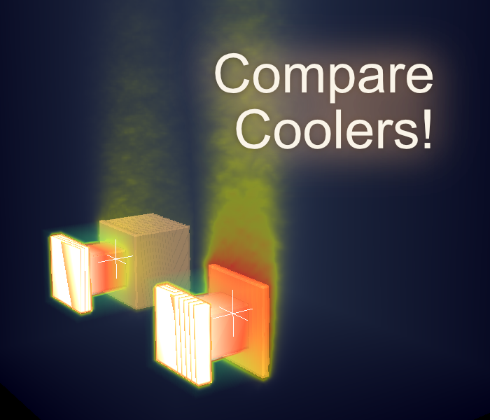

# BeerHeater
Simulation of heating beer (__physically based!__) and other less interesting test setups.

Project about simulating air flow and heat distribution for course *Animation and Simulation* at University of Koblenz in summer terms 2015. Written by Nils Höhner and Raphael Menges in C++ and modern OpenGL. Simulation is implemented as highly parallel compute shader execution. The process is physically based but (by far) not correct.

## Screenshots

## HowTo
Clone the repository to your local machine. Dependencies are included. Build project for the IDE of your choice with CMake. Tested with Visual Studio 2015 and GCC under Ubuntu 16.04.

## TODO
* Fans are not rendered
* Make simulation frame time independend

## Dependencies
* GLFW3: https://github.com/glfw/glfw
* GLM: http://glm.g-truc.net/0.9.7/index.html (MIT license chosen)
* picopng: http://lodev.org/lodepng/picopng.cpp

## License
>The MIT License (MIT)

>Copyright (c) 2016 Nils Höhner and Raphael Menges

>Permission is hereby granted, free of charge, to any person obtaining a copy of this software and associated documentation files (the "Software"), to deal in the Software without restriction, including without limitation the rights
to use, copy, modify, merge, publish, distribute, sublicense, and/or sell copies of the Software, and to permit persons to whom the Software is furnished to do so, subject to the following conditions:

>The above copyright notice and this permission notice shall be included in all copies or substantial portions of the Software.

>THE SOFTWARE IS PROVIDED "AS IS", WITHOUT WARRANTY OF ANY KIND, EXPRESS OR IMPLIED, INCLUDING BUT NOT LIMITED TO THE WARRANTIES OF MERCHANTABILITY, FITNESS FOR A PARTICULAR PURPOSE AND NONINFRINGEMENT. IN NO EVENT SHALL THE AUTHORS OR COPYRIGHT HOLDERS BE LIABLE FOR ANY CLAIM, DAMAGES OR OTHER LIABILITY, WHETHER IN AN ACTION OF CONTRACT, TORT OR OTHERWISE, ARISING FROM, OUT OF OR IN CONNECTION WITH THE SOFTWARE OR THE USE OR OTHER DEALINGS IN THE SOFTWARE.
